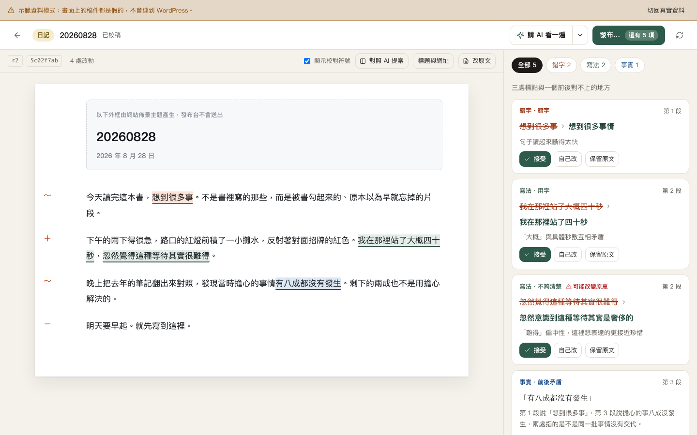
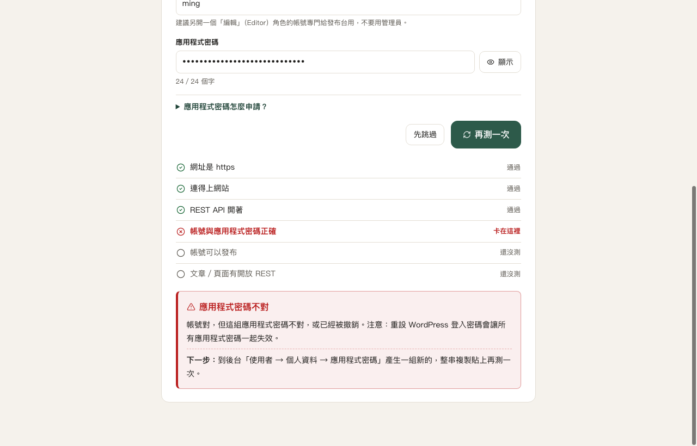
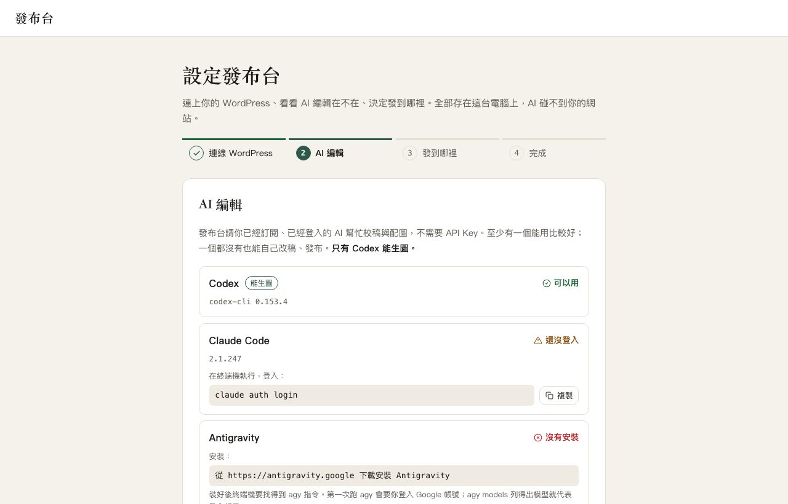
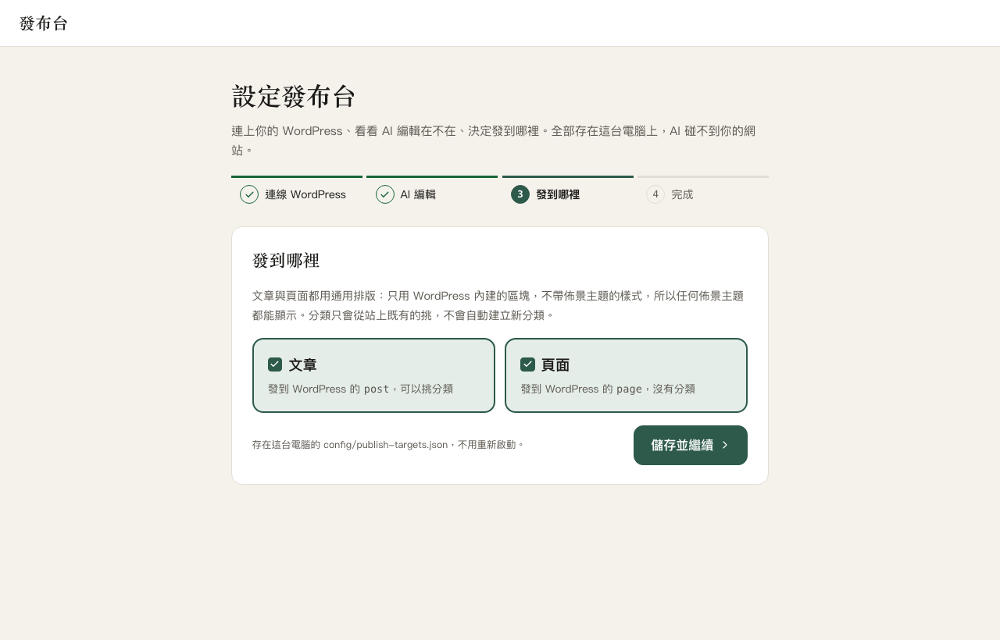

[English](./README.md) | 繁體中文

# Galley

**Local AI copy desk for WordPress**——只在你自己電腦上執行的 WordPress 發布台。

**本機 AI 當編輯，你當總編。** 你貼上文章，請你已經訂閱、已經登入的 AI（Codex／Claude Code／Antigravity）
校稿、建議配圖；你逐項決定、看過成品、按下核准，Galley 才用 WordPress 的 REST API 把文章送到你的站。

為什麼這樣做：

- **AI 碰不到你的 WordPress。** AI 只拿到文章內容，拿不到 WordPress 密碼，每次都在隔離、唯讀、關掉工具的工作區裡執行；
  真正發文的是 Galley 裡固定的程式，而且只有在你按下核准之後。
  市面上的 AI 外掛多半是「裝進站裡、給它權限、讓它幫你寫」，Galley 反過來。
- **不需要任何 AI API key。** 直接呼叫你電腦上已登入的官方 CLI，用的是你原本的訂閱額度。
- **不用在站上裝任何東西。** 只用 WordPress 內建的應用程式密碼（Application Password）與 REST API。



（截圖是示範資料模式，內容是假的。）

> ⚠️ **早期版本，不提供支援。** 這是作者自用工具開源出來的，自己架、自己修。使用前請先看下方「限制與注意」。

## 功能

- **AI 校稿以提案呈現**：錯字、寫法、事實疑點標在文章上，右邊卡片逐項「接受／自己改／保留原文」。
  AI 不會直接改你的稿；需要人判斷的疑點（例如前後矛盾）只提出，不動手。
- **配圖建議與 Codex 生圖**：AI 提出每張圖放哪裡、畫什麼；描述可以直接在卡片上改。
  有 Codex 的話可以按「用 Codex 生圖」，先給你看，按「用這張」才上傳到 WordPress 媒體庫。
- **本機校樣**：在本機先看成品長什麼樣子，也能和改之前的版本對照，只列出有改的段落。
- **核准後才發布**：發布面板會先顯示真正會送出的內容與發到哪裡，按核准之後才能發布（可選草稿或公開）。
- **內容一改，核准就失效**：核准綁定當下那一版內容，之後任何改動都要重新核准。
- **在文章上直接插圖**：段落之間可以按「在這裡插圖」，挑已上傳的圖、自己上傳，或請 Codex 讀前後段落配一張。
- **建議英文網址**：AI 讀標題與內文開頭，給 3 個英文網址（slug），知道作品的官方英文名就用它；
  點了才填入，不會自動填。中文文章特別有用。
- **發布時指定作者**：每個站設一次預設作者，發布面板會顯示，也可以只改這一篇。
- **設定精靈**：第一次打開就引導你連線 WordPress、偵測 AI 編輯、選發布目的地，每一步失敗都會講卡在哪裡。

## 限制與注意

- **只在本機跑、單人單站**：只監聽 `127.0.0.1`，不是雲端服務；一次連一個 WordPress 站。
- **介面目前只有繁體中文。**
- **只送正文**：文章的外框（標題區、側欄、頁尾等）由你站上的佈景主題產生，Galley 只送文章內容。
  不支援自訂內容類型（custom post type）。
- **內容類型**：一般人請用通用的「文章」「頁面」。程式裡的「長文」（`longform`）和「日記」（`diary`）
  是作者自己站台的設定，別的站用不到。
- **AI CLI 的使用條款**：各家 AI CLI 的使用條款是否允許第三方工具這樣呼叫，**作者尚未查證**。使用前請自行確認。
- **公開發布收不回來**：把文章改成公開，可能觸發站上的電子報或自動分享外掛，**寄出去就收不回來**。
  建議先發成草稿，到 WordPress 後台確認後再公開。
- **不能修改已經發布的文章**：發出去之後要改，請到 WordPress 後台改。

## 需求

- macOS 或 Linux，Node.js ≥ 22.5（需要內建的 `node:sqlite`；開發機實測 v26.7.0）
- 一個 **https** 的 WordPress 站（5.6 以上，內建「應用程式密碼」），和一個能發文的帳號
- 至少一個 AI 編輯（選用，見下方「AI 編輯」）；一個都沒有也能自己改稿、發布

## 安裝與啟動

```bash
git clone https://github.com/x52640/wp-galley.git
cd wp-galley
npm install
npm run build
npm start                 # 打開 http://127.0.0.1:3000
```

第一次打開會自動進**設定精靈**，不用先改任何設定檔。

## 設定精靈

四步，每一步失敗都會講「卡在哪裡、下一步做什麼」：

1. **連線 WordPress**：填網址、帳號、應用程式密碼，按「測試連線」。
   測試只會讀取（不會在站上建立或修改任何東西），會分別告訴你：網址是不是 https、連不連得上、
   REST API 有沒有被安全外掛或主機商擋住、帳號密碼對不對、站上有沒有關掉應用程式密碼、
   這個帳號能不能發文。通過後按「儲存並繼續」。
2. **AI 編輯**：偵測三個 CLI 有沒有裝、有沒有登入。沒裝或沒登入的，畫面上會給你要在終端機執行的指令
   （Galley 不會替你安裝或登入）。
3. **發到哪裡**：勾「文章」和／或「頁面」。
4. **完成**：進稿件總覽，直接開新稿。

存好就生效，**不用重新啟動**。之後要改，按稿件總覽右上角的齒輪「設定」重跑一次。
換到另一個站時，精靈會先講清楚哪些不會跟過去（已經發到舊站的稿件、傳到舊站媒體庫的圖），確認之後才存。

測試連線失敗時，畫面會列出過了哪幾關、卡在哪一關，以及下一步：



第二步列出每個 AI 編輯的狀態，沒裝或沒登入的附上要自己執行的指令：



第三步選要發到文章還是頁面：



（截圖是示範資料模式，網址與帳號都是假的。）

### 應用程式密碼怎麼申請

應用程式密碼是 WordPress 內建、專門給外部程式用的密碼，**不是你的登入密碼**，可以隨時單獨撤銷。

1. 建議先在後台「使用者 → 新增使用者」開一個**編輯（Editor）**角色的帳號專門給 Galley 用，不要用管理員。
2. 用那個帳號登入後台，左邊選「使用者 → 個人資料」。
3. 捲到最下面「應用程式密碼」，名稱填「Galley」，按「新增應用程式密碼」。
4. 把出現的那串 24 個字（每 4 個一組）整串複製，貼到精靈裡。它只會顯示這一次。

找不到「應用程式密碼」這一區：站台要是 https，而且沒有被安全外掛關掉。精靈的測試連線會告訴你是哪一個。

⚠️ 重設這個帳號的登入密碼，會讓它所有的應用程式密碼一起失效，要重新產生一組、重跑精靈。

### 密碼存在哪裡

精靈把網址、帳號、應用程式密碼寫進專案根目錄的 `.env`（權限 0600，只有你的帳號讀得到；
已在 `.gitignore`，不會進 Git）。發布目標寫進 `config/publish-targets.json`（本機檔，也不進 Git）。
密碼只在按「測試連線」時從瀏覽器送到本機後端一次，之後任何畫面、回應、log 都不會再出現。
細節見 [`docs/specs/security.md`](./docs/specs/security.md)「設定精靈寫入的秘密」。

## AI 編輯

Galley 直接呼叫你電腦上已經登入的官方 CLI，用的是你原本的訂閱額度。三個都是選用的，裝一個就能用。
**只有 Codex 能生圖**；其他兩個能校稿、建議配圖，但不能畫。

| AI 編輯 | 需要的訂閱 | 安裝 | 登入 |
| --- | --- | --- | --- |
| Codex | ChatGPT 付費方案（Plus 以上） | `npm install -g @openai/codex` | `codex login` |
| Claude Code | Claude 付費方案（Pro 以上） | `npm install -g @anthropic-ai/claude-code` | `claude auth login` |
| Antigravity（`agy`） | Google 帳號 | 從 https://antigravity.google 下載安裝 | 第一次執行 `agy` 時登入；`agy models` 列得出模型就代表好了 |

裝好或登入之後不用重開 Galley，在精靈第二步按「重新偵測」就好。

再提醒一次：各家 CLI 的使用條款是否允許第三方工具呼叫，尚未查證，請自行確認。

## 不用精靈、手動設定

```bash
cp .env.example .env                                           # 填 WORDPRESS_URL、WORDPRESS_USERNAME、WORDPRESS_APP_PASSWORD
cp config/publish-targets.example.json config/publish-targets.json
```

手動改 `.env` 要重新啟動才會生效。WordPress 相關三個變數要**一起填或一起留空**，只填一半會在啟動時報錯。

## 安全設計

- 只綁 `127.0.0.1`，擋 DNS rebinding 與其他網頁送來的修改請求。
- AI 只回傳結構化資料，HTML 由固定程式產生；後端會用原始規則再驗一次 AI 的輸出。
- AI CLI 在隔離的唯讀工作區執行，不授權它使用 shell、寫檔、連網或 WordPress 工具，有逾時、一次只跑一個；
  它也拿不到 WordPress 密碼。
- 密碼只存在後端記憶體與 `.env`。
- 核准只能由本機畫面建立，內容一改核准就失效。

細節見 [`docs/specs/security.md`](./docs/specs/security.md)。

`.env`、`config/publish-targets.json`、`data/`、`drafts/`、`generated-images/`、`backups/` 都不進版控。

## 開發

```bash
npm run migrate           # 建立 data/publisher.sqlite（啟動時也會自動套用）
npm run dev               # 後端 127.0.0.1:3000 + Vite UI 127.0.0.1:5173
```

UI 網址加上 `?fixtures=1` 是示範資料模式，不連後端；`?fixtures=1&setup=needed` 會從設定精靈開始，
第一步有下拉選單可以模擬每一種連線失敗。

| 指令 | 用途 |
| --- | --- |
| `npm run dev` | 同時啟動後端（tsx watch）與 Vite UI |
| `npm run dev:server` | 只啟動後端 |
| `npm run dev:ui` | 只啟動 UI（會 proxy `/api` 到 3000） |
| `npm run build` | 編譯後端到 `dist/`、UI 到 `dist/ui/` |
| `npm start` | 執行已建置的服務 |
| `npm run migrate` | 套用 SQLite migration |
| `npm test` | 跑全部測試（Vitest；不呼叫真的 AI CLI、不連真的 WordPress） |
| `npm run test:watch` | watch 模式 |
| `npx vitest run tests/health.test.ts` | 只跑單一測試檔 |
| `npx vitest run -t "遮蔽"` | 只跑名稱含關鍵字的測試 |
| `npm run typecheck` | TypeScript 檢查（不產生輸出） |
| `npm run verify` | typecheck ＋ 全部測試（commit 前的品質閘） |

## 給貢獻者

這個專案用一組文件管理決策與進度，改程式之前請先看：

- [`plan.md`](./plan.md)：產品目標、範圍與決策記錄
- [`docs/README.md`](./docs/README.md)：文件的權威順序與規則
- [`docs/CURRENT_TASK.md`](./docs/CURRENT_TASK.md)：目前進度
- [`docs/specs/`](./docs/specs/README.md)：技術規格

文件目前以繁體中文撰寫。新功能請開 PR。

## 授權

[MIT](./LICENSE)。這是開源自架工具：自己架、自己修，不提供支援。

WordPress 是 WordPress Foundation 的商標；本專案與 WordPress Foundation 無關。
